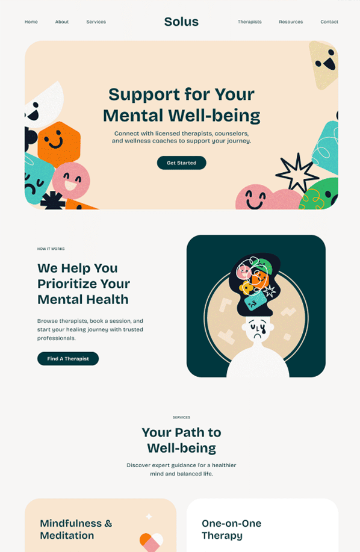

# 🌟 Final Project DevF

¡Bienvenido a mi proyecto final de DevF! Este repositorio contiene el código fuente de una aplicación web sencilla pero funcional. 🚀

## 📂 Estructura del Proyecto

```
index.html
styles.css
public/
    assets/
```

## 🚀 Cómo Clonar y Ejecutar

Sigue estos pasos para clonar y ejecutar el proyecto en tu máquina local:

1. **Clona el repositorio:**
   ```bash
   git clone https://github.com/Josem1801/devf-website-project.git
   ```

2. **Navega al directorio del proyecto:**
   ```bash
   cd final-proyect-devf
   ```

3. **Abre el archivo `index.html` en tu navegador:**
   - Puedes abrirlo directamente o usar una extensión como [Five Server](https://marketplace.visualstudio.com/items?itemName=yandeu.five-server) para un servidor local.


## 🖼️ Vista previa




## 🛠️ Herramientas Utilizadas

- **HTML5**
- **CSS3**

## 🤝 Contribuciones

¡Las contribuciones son bienvenidas! Siéntete libre de abrir un issue o enviar un pull request. 💡

## 📄 Licencia

Este proyecto está bajo la Licencia MIT. Consulta el archivo `LICENSE` para más detalles.

---

Hecho por Jose.